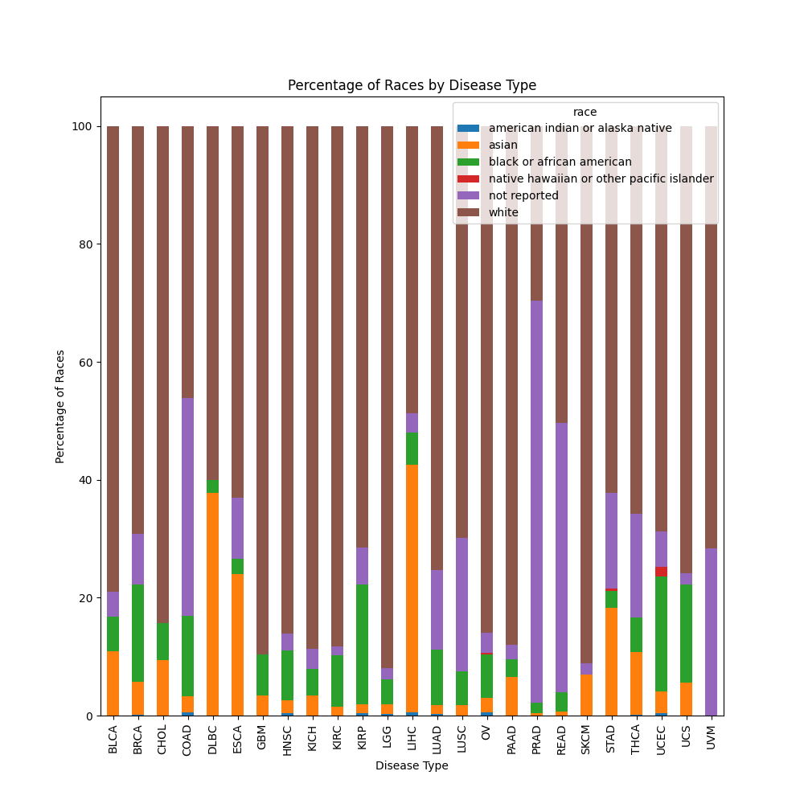

# DataGPT
A wrapper for the prompt-debug-plot workflow of data science with ChatGPT.

## Starting
Install any plotting libraries you want to use, as well as the openai API and pandas.
```
datagpt = DataGPT(data_dir='<dir containing one or several .csvs>', figure_dir='<dir to save resulting plots/tables>')
datagpt.run()
```

## Workflow
Sometimes the sanity check will fail. If this happens, just restart your run. Here's an example, where I've placed a file metagene_loadings.csv in the data_dir.
```
$ python datagpt.py
Please describe your task to me, or type exit to exit.
$ Using the clinical covariates, group the rows by disease_type and plot the percentage of each race within each disease type.
There was an error in my code. Would you like me to debug? [y]/n
$ y
Please describe your task to me, or type exit to exit.
$ Please stack the bars so they add to 100 percent.
Please describe your task to me, or type exit to exit.
$ exit
```
The resulting script is simple but would have taken me about 30 minutes to make after parsing documentation to find the right plot type and parameters. Using DataGPT, it took about a minute to describe my visiion for a plot, auto-debug, update with some new constraints, and get a final figure. The script generated by ChatGPT is saved to `demo/workflow.py`.

